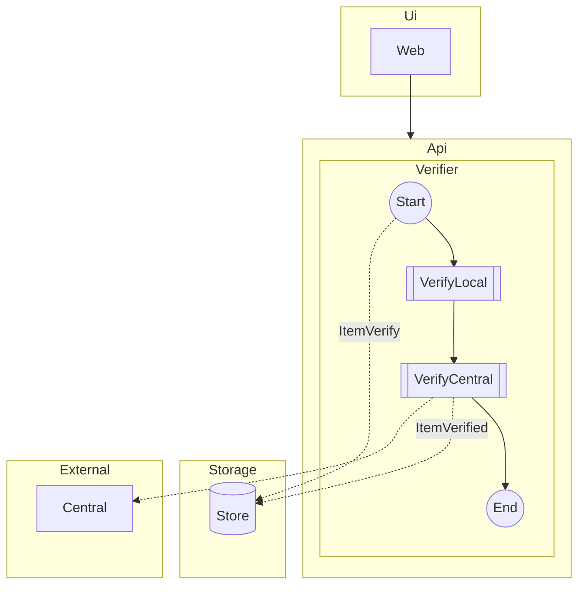

# AcceptanceT1

```mermaid
flowchart TB
  subgraph Ui
    Web
  end
  subgraph Api
    subgraph Verifier
      StartVerify((Start))
      VerifyLocal[[VerifyLocal]]
      VerifyCentral[[VerifyCentral]]
      EndVerify((End))
    end
  end
  subgraph Storage
    Store[(Store)]
  end
  subgraph External
    Central
  end
  Web --> Verifier
  StartVerify -.->|ItemVerify| Store
  StartVerify --> VerifyLocal
  VerifyLocal --> VerifyCentral
  VerifyCentral -.-> Central
  VerifyCentral -.->|ItemVerified| Store
  VerifyCentral --> EndVerify
```
